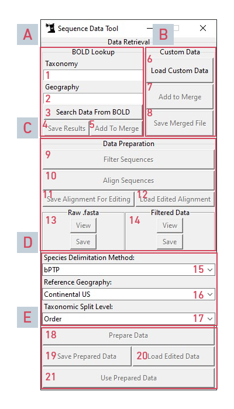
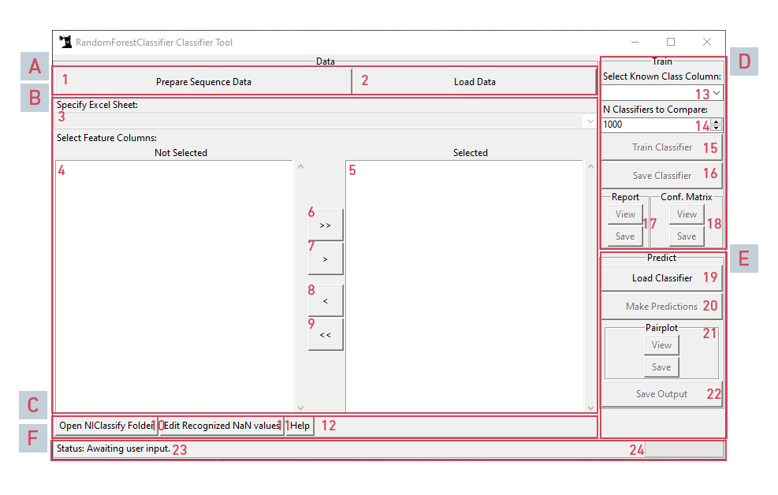

# User's Manual

Welcome to the NIClassify User's Manual!

## Contents

<!-- TOC -->

- [User's Manual](#users-manual)
  - [Contents](#contents)
  - [What is NIClassify?](#what-is-niclassify)
  - [On First Launch](#on-first-launch)
  - [The Sequence Data Tool](#the-sequence-data-tool)
    - [Overview](#overview)
    - [Using the Sequence Data Tool](#using-the-sequence-data-tool)
      - [Importing Custom Data](#importing-custom-data)
      - [Retrieving BOLD Data](#retrieving-bold-data)
      - [Merging Data](#merging-data)
      - [Initial Data Preparation](#initial-data-preparation)
      - [Final Data Preparation](#final-data-preparation)
  - [The Classifier Tool](#the-classifier-tool)
    - [Overview](#overview-1)
    - [A Note on the Tool](#a-note-on-the-tool)
    - [Using the Classifier Tool](#using-the-classifier-tool)
      - [Training a Classifier](#training-a-classifier)
      - [Making Predictions using a Trained Classifier](#making-predictions-using-a-trained-classifier)

<!-- /TOC -->

## What is NIClassify?

NIClassify is a combined toolkit for classifying species (usually, as in the name, as Native or Introduced), based on the principles laid out in [Categorization of species as likely native or likely non-native using DNA barcodes without a complete reference library.](https://doi.org/10.1002/eap.1914) (Andersen JC, et al.)

The primary function of the program is to train a Random Forests Classifier on a given dataset of nucleotide diversity features for species of known status (native/introduced), and then generate predictions with a measure of likelihood on a set of samples with said features and an unknown status. These steps are made as straightforward and automated as possible.

The secondary function of the program is to automatically retrieve and prepare data for either training or prediction from the [Barcode Of Life Data system (BOLD)](http://www.barcodinglife.org/), with support for automated search for known classifications of species from the [Global Biodiversity Information Facility (GBIF)](https://www.gbif.org/) and the [Integrated Taxonomic Information System (ITIS)](https://www.itis.gov/).

This document will attempt to explain the use of both of these functions in as straightforward and detailed a manner as possible. As it is generally the order in which this program is used, the secondary function (The Sequence Data Tool) will be covered first, followed by the primary function (The Classifier Tool). Please refer to the table of contents to skip to a specific section if you do not need a full walkthrough.

## On First Launch

The first time you open the program, it will create a folder in your `Documents` folder named `niclassify`, with a number of subfolders for data, output files, logs, and config files. It is recommended that you move any custom data you will be using to the appropriate subfolders fore ease of access.

## The Sequence Data Tool

### Overview

Below is an overview of the Sequence Data Tool, with an explanation of each input and button in the interface. In subsequent subsections, buttons and inputs will refer to the letters and numbers on this diagram for ease of reference. For example, instructions referencing the Taxonomic Search Criteria Input will reference as (A1), referencing the section letter and input number.

**A: BOLD Lookup Section:** This section is used for retrieving raw data from BOLD.

1. **Taxonomic Search Criteria:** Accepts one name from any taxonomic level
2. **Geographic Search Criteria:** Accepts one geographic area as supported by BOLD's API. Less likely to work on general regions, so it's better to use with countries, states, or continents.
3. **Search Button:** Commences the search, downloading any results to a temporary file.
4. **Save Button:** Opens a dialog to save the retrieved data to a location of your choosing.
5. **Merge Button:** Useable after a second search or when searching after importing custom data. Allows you to merge multiple searches/data files into one temporary file for subsequent preparation.

**B: Custom Data Section:** This section is used for importing data you have stored locally.

6. **Load Data Button:** Opens a file dialog to load a locally saved data file of your choosing.
7. **Merge Button:** Useable after loading a second file or when loading a file after retrieving data from BOLD. Allows you to merge multiple searches/data files into one temporary file for subsequent preparation.
8. **\*Save Merge Button:** Useable after merging data. Opens a file dialog to save merged data to a location of your choosing.

**C: Sequence Alignment Section:** This section is used to filter and align the raw data, and export various files from those steps. Buttons only become available as each step is completed.

9. **Filter Sequences Button:** Filters the raw data. Sequences missing the marker code COI-5P, or with fewer than 350 (or a custom number of) base pairs, as well as complete duplicates (all rows, not just the sequence, are the same), are dropped. Additionally, a new column, UPID (Unique Process ID) is created to distinguish each sample uniquely.
10. **Align Sequences Button:** Generates a FASTA-formatted alignment of all sample sequences.
11. **Save Alignment Button:** Opens a file dialog to save the alignment to a location of your choosing.
12. **Load Alignment Button:** Opens a file dialog to load a previously saved alignment. You may elect to do this instead of pressing the Align Sequences Button (C10) if you have previously aligned your given data.
13. **Raw Fasta Controls:** These two controls allow you to view or save the raw (unaligned) FASTA file of the filtered sequences. View opens the temporary file in the default program for FASTA files on your system (or file location in the file explorer, if there is no default), while Save opens a file dialog to save the raw FASTA to a location of your choosing.
14. **Filtered Data Controls:** These two controls allow you to view or save the filtered data. View opens the temporary file in your systems default program for CSV files (or the file explorer to the file location if there is no default), while Save opens a file dialog to save the filtered data to a location of your choosing.

**D: Data Preparation Settings:** This section contains settings for different stages of data preparation.

15. **Species Delimitation Method Setting:** This dropdown lets you choose which species delimitation method the data preparation tool will use. Currently [Bayesian Poisson Tree Processes (bPTP)](https://doi.org/10.1093/bioinformatics/btt499) and [Generalized Mixed Yule Coalescent (GMYC)](https://rdrr.io/rforge/splits/man/gmyc.html) are implemented. bPTP tends to run faster and produce better results for this program's purposes, so it is used by default.
16. **Reference Geography Setting:** This dropdown lets you set the 'native' geography that species will be compared against when their native ranges are automatically searched. Species known to be native to a chosen geography, a geography it contains, or a geography containing it, will be marked as native.
17. **Taxonomic Split Level Setting:** This dropdown lets you choose which taxonomic level the data will be split by prior to species delimitation and feature generation. The data is subset by this level, with each subset having delimitation and feature generation applied separately. Largely this subsetting is only applied for performance reasons, however choosing to subset by smaller taxonomic levels may result in differences in features generated. Subsetting by order offers good performance while theoretically not affecting species delimitation or greatly affection feature generation, and so is the default option. Larger taxonomic levels may offer more useful feature generation, but will adversely affect performance (much greater processing time). If `No Split` is selected, the data will not be subset, and all operations will be performed on the full dataset.

**E: Final Preparation Section:** This section is used to make final preparations to the data and to save and/or send the data to the Classifier Tool

18. **Data Preparation Button:** This button runs the main data preparation. The data is subset by a the chosen taxon level (D17). On each subset, species are delimited using the chosen method (D15), and then a series of features are generated using different measures of inter- and intra- species diversity and similarity. After this, subsets are recombined and the program attempts to determine known species statuses by comparing the any known native ranges from GBIF and ITIS against the chosen reference geography (D16). Please note that this step will take a fairly long time, and depending on the sample size and processing speed of your system, may take anywhere between 5 minutes and many hours to complete.
19. **Save Prepared Data Button:** This button opens a file dialog allowing the you to save the prepared data to a location of your choice.
20. **Load Prepared Data Button:** This button allows you to quickly load prepared data after saving it, in case the prepared data required any edits before being sent to the Classifier Tool.
21. **Use Prepared Data Button:** This button sends the prepared data to the Classifier Tool. Please note that Sequence Data Tool trims unnecessary columns from the data before sending it to the Classifier Tool so as to streamline feature selection. Use the Save Prepared Data Button (E19) to save the complete data with all columns.

[(Return to Contents)](#User's-Manual)

### Using the Sequence Data Tool

The Sequence Data Tool may be reached by clicking "Prepare Sequence Data" On the Classifier Tool (see Classifier Tool - Overview).

The first step is to either look up data from BOLD or to import custom data from your filesystem. Because there are a few more complications to custom data, this will be covered first.

[(Return to Contents)](#User's-Manual)

#### Importing Custom Data

When importing data, there are a number of required columns. At minimum, the following columns (with the specified names exactly) are required:

- Either `processid` or `UPID`. If `UPID`, the values in the column must be guaranteed to be unique for each row, or the program may encounter errors or output unexpected data.
- `nucleotides` containing nucleotide sequences. Sequences with less than 350 (or a custom number of) base pairs will be dropped. These sequences need not be aligned.
- `marker_codes` (optional) containing marker code information. Rows not containing the marker code `COI-5P` will be dropped.
- `species_name` containing the name of the species for the given sample.

If no other columns are selected, you must select the "No Split" option in the Taxonomic Split Level Settings (D17). If you wish to split by a taxonomic level, you must have a column specifying that taxonomic level for each sample named _\<taxonomic level name\>\_name_. For instance, if you wish to split by order, there must be a column named `order_name` specifying the order name for each sample. The system will tolerate missing taxonomic level names, however relying on this is very likely to cause useless feature data.

To import custom data, assuming it satisfies these requirements, click the Load Custom Data Button (B6), navigate to the data file, and select it. The program will warn you of any problems it can detect while attempting to read the file.

[(Return to Contents)](#User's-Manual)

#### Retrieving BOLD Data

Data may be searched and retrieved from BOLD. To do so, follow the steps below:

1. Write a taxonomy, such as lepidoptera, in the input labeled "Taxonomy" (A1) and geographic region, such as Massachusetts, in the input labeled "Geography" (A2).
2. Click the button labeled "Search Data From BOLD" (A3)

Depending on the number of returns, this may take anywhere from a few seconds to a few minutes. You will be notified when the search is completed.

[(Return to Contents)](#User's-Manual)

#### Merging Data

If you wish to make multiple searches, combine multiple local files, or combine search data and custom data, you may do so using the appropriate merge buttons (A5, A8). There are three ways to merge:

**Merging two search results:** To merge two search results, make a second search. After this second search has completed, click "Add to Merge" (A5). If you wish to merge more than two search results, you must add each search to the merge after _each_ subsequent search. If you do not add the results to the merge, the data used for subsequent steps will be the results of the _most recent search_.

**Merging two custom data files:** To merge two data files, open a second data file. You will be presented with an Overwrite Warning. Click "OK" and select your second file. Once the data has been loaded, click "Add to Merge" (B7). If you wish to merge more than two custom data files, you must add _each_ file to the merge after loading it. If you do not add a newly loaded file to the merge, then the _most recently loaded file_ will be used for subsequent steps.

**Merging custom data and BOLD results** To merge custom data and BOLD results, in either order, first complete either a search or load a custom file, and then load or search the other. The Custom Data section's "Add to Merge" button (B7) will become available. Click it to merge the data. In order to merge more than two datasets from either source, be sure to click this button after each new search or file.

Be careful whenever completing any of these steps to not repeatedly click an "Add to Merge" button, as this will result in duplicate data being merged in. While the system will tolerate this, it may make data filtering take longer.

**Restarting a Merge:** There is currently no way to remove data from a merge. To start a merge over again, you have to close the Sequence Data Tool, and open it again from the Classifier Tool.

[(Return to Contents)](#User's-Manual)

#### Initial Data Preparation

Once you have your data loaded, you may begin to prepare it. Follow the below steps:

1. **Filter Sequences.** First, press the button labelled "Filter Sequences" in the Data Preparation section (C9). This should take very little time, but for extremely large datasets it may take a while.
2. **Align Sequences.** Press the button labelled "Align Sequences" (C10). This may take some time. If you already have an alignment of your data prepared, you may instead click "Load Edited Alignment" (C12). You may be warned that the alignment contains sequences not present in the filtered data. If the alignment file is correct, then these may simply be sequences that were filtered from the raw data, and the warning may be safetly ignored.
3. **(Optional) Check Alignment.** If you had the sequences automatically aligned, you may wish to check that the alignment was processed correctly. Click "Save Alignment for Editing" (C11) and save the alignment to a location of your choosing. You may wish to do this regardlessly, in the event you wish to process this same raw data again in the future. You may now edit the saved file as necessary, and re-import it by clicking "Load Edited Alignment" (C12) and selecting the file. This will overwrite the current alignment in the program.

At this point, you have completed the initial preparation, and may move on to the next preparation step. You may wish to download the raw (unaligned) FASTA file, and the filtered data, which you may do using the appropriate sections (C13) and (C14), respectively.

[(Return to Contents)](#User's-Manual)

#### Final Data Preparation

Before initiating the final data preparation, you may wish to change the settings, such as the Species Delimitation Method (D15), Reference Geography (D16), and Taxonomic Split Level (D17). Please refer to the overview for the details on these settings.

Additionally, recall that if you are using custom data with no taxonomic names to split by, it is required that you select "No Split" in the Taxonomic Split Level dropdown (D17).

You are ready to initiate final data preparation. Click "Prepare Data" (E18). You may be presented with warnings if any data is out of order, or if any uncaught exceptions occur. This process will take a great deal of time, ranging from a half hour (~300 samples on the development system of this project) to many hours for significantly larger quantities of data. The time increase is not linear, so be prepared to wait a while. If the data preparation appears to be taking an unreasonable amount of time, please open an issue on the project's Github repository, or contact the developer via email. If this occurs, you may have to forcibly quit the application using the task manager.

When the data preparation is complete, you will be notified. You may be given a number of warnings when data preparation is complete, such as few observation samples being successfully classified by automated lookup, or a significant imbalance between auto-lookup native and introduced classifications. Please save the prepared data by clicking "Save Prepared Data" (E19). You may load any edits you have made to this saved data at this point by clicking "Load Edited Data" (E20).

It is recommended at this point that you review the data and make any manual additions and edits that may be required, however if you are confident you may now send the data to the Classifier Tool by clicking "Use Prepared Data" (E21).

[(Return to Contents)](#User's-Manual)

## The Classifier Tool

### Overview

Below is an overview of the Classifer Tool, with an explanation of each input and button in the interface. In subsequent subsections, buttons and inputs will refer to the letters and numbers on this diagram for ease of reference. For example, instructions referencing the Prepare Sequence Data Button will reference as (A1), referencing the section letter and input number.

[(Return to Contents)](#User's-Manual)

**A: Data Import Section:** This section is used for importing data or opening the Sequence Data Tool.

1. **Prepare Sequence Data Button:** This button opens the Sequence Data Tool.
2. **Load Data Button:** Opens a file dialog for loading already-prepared feature data from the local filesystem.

**B: Data Feature Selection Section:** This section is used for selecting the proper columns for feature data, and the proper sheet, if using an Excel workbook.

3. **Excel Sheet Specifier Dropdown:** This dropdown is used to specify which Excel sheet to get data from if data is being loaded from an Excel workbook.
4. **'Not Selected' Columns List:** This area contains a list of columns not currently selected as feature data. Feature data is used in training the classifier, while all other data is not.
5. **'Selected' Column List:** This area contains a list of columns which have been selected as feature data. The buttons (B6-B9) are used to move columns between the two lists.
6. **Move All Columns Right Button:** This button moves all items from the 'Not Selected' list to the 'Selected' list.
7. **Move Columns Right Button:** This button moves any highlighted columns from the 'Not Selected' list to the 'Selected' list. Multiple columns may be highlighted by click-dragging (highlights all dragged over), or shift-clicking (highlight all since last click), or by control-clicking (toggles highlight on clicked without changing others).
8. **Move Columns Left Button:** This button moves any highlighted columns from the 'Selected' list to the 'Not Selected' list. See (B7) for highlighting tips.
9. **Move All Columns Left Button:** This button moves all columns from the 'Selected' list to the 'Not Selected' list.

**C: Utility Buttons Section:** This section offers a few smaller utility functions, such as opening this help file.

10. **Open NIClassify Folder Button:**: This button opens the program's user folder located in your `Documents` folder.
11. **NaN Value Edit Button:** This button opens a smaller editor window for adding and removing values that are recognized to be NaN/Null. Values in this list will be treated as if the cell were blank.
12. **Help Button:** This button opens a PDF of this document.

**D: Classifier Training Section:** This section is used for training a classifier on the imported data.

13. **Known Class Column Selection:** This dropdown presents a list of columns in the currently loaded data column. Use it to select the column which carries known classifications as native/introduced. The column used must not also be selected as a feature column.
14. **N Classifier Selection:** This number input allows you to specify how many classifiers are to be generated. Each classifier competes with the others in order to produce the best results. Generally, 10 is enough to get a snapshot of how the classifier might perform, while 1000 is enough to virtually guarantee that the winning classifier will be the best-performing classifier possible. Higher numbers will take longer to train and test, and too many may lead to overfitting issues. The default is 1000.
15. **Train Classifier Button:** Initiates the classifier training process.
16. **Save Classifier button:** Opens a file dialog to save the classifier in a location of your choosing. The saved classifier may be re-imported at a later date for use in predictions.
17. **Report Section:** These buttons allow you to view and save a log report of the training process and classifier performance. View Opens a temporary file of the report in your system default text editor, while Save opens a file dialog to save the report in a location of your choosing.
18. **Confusion Matrix Section:** These buttons allow you to view and save a confusion matrix that is generated after the classifier is trained. The confusion matrix allows you to view performance in a grid of True and False Positives and Negatives. This confusion matrix will not be perfectly representative of output predictions on your training dataset if it contains unknown values due to the process of data imputing during prediction. View opens a temporary file of the matrix in your system default image viewer, while Save opens a file dialog to save the matrix in a location of your choosing.

**E: Classifier Prediction Section:** This section is used for performing predictions on data with unknown classes.

19. **Load Classifier Button:** Opens a file dialog to load a previously saved classifier. A classifier may only be used with data that has the matching featuer columns (number and name) as the data it was trained on.
20. **Make Predictions Button:** Initiates the prediction process using either the just-trained classifier or previously-loaded classifier, whichever is appropriate (or more recent).
21. **Pairplot Section:** These buttons allow you to view and save a pairplot that is generated after predictions are made. If there are too many feature columns (more than 25) a pairplot will not be generated, as the resulting plot will be almost illegible, and generally worthless for analysis. View opens a temporary file of the plot in your system default image viewer, while Save opens a file dialog to save the plot in a location of your choosing.
22. **Save Output Button** Opens a file dialog to save the output predictions in a location of your choosing.

**F: Information Section:** This section offers information on what the program is doing and what progress it's making on certain functions. 23. **Status Text:** This text will change to attempt to hint at the status of the program. 24. **Progress Bar:** This progress bar will either fill to show current progress in a task, or when that is impossible, at least leave a bouncing bar to demonstrate that the program has not frozen.

[(Return to Contents)](#User's-Manual)

### A Note on the Tool

This tool was created as a generalized classifier tool, and as such works independently of the requirements of the Sequence Data Tool. In theory, any data may be input to the Classifier Tool for training, so long as there is at least one feature column and one known label column. Obviously, this does not mean that this classifier tool can classify anything using any data.

Please read up on Random Forest Classifiers before attempting to use this classifier for anything other than what it was strictly intended for. In fact, it is best to read up on Random Forest Classifiers before using this tool for its intended purpose, to understand the strengths and limitations of this tool. Every classifier is, in some portion, vulnerable to a host of problems such as overfitting, underfitting, bias, etc, and this one is no exception.

Put simply, use this tool with great care. Always use such tools as ethically as possible.

[(Return to Contents)](#User's-Manual)

### Using the Classifier Tool

#### Training a Classifier

**Loading Data:** You may either Load a data file directly from you filesystem, or launch the Sequence Data Tool in order to retrieve or further prepare data. For the former, you may simply click "Load Data" (A2) and select a file in the subsequent file dialog that opens. For the Latter, click "Prepare Sequence Data" (A1) and see the Sequence Data Tool section.

If the file you select is an Excel workbook, you will be given a warning that you must select which sheet to use (unless there is only one sheet). In this case, select the proper sheet in the dropdown labeled "Specify Excel Sheet" (B3).

**Selecting Features:** The columns of your data file will appear in the 'Not Selected' List of the 'Select Feature Columns' section (B4). Highlight all columns that are features to be used in classification (if the data was automatically prepared using the Sequence Data Tool, these would be `ksDist_mean` through `dnaSim_max`), and click the single right arrow (second button) (B7). You have successfully selected your training features.

**Configuring Classifier:** Use the dropdown labeled "Select Known Class Column" (D13) to select the column with known classifications. Set the number of classifiers to compare (D14). This may be left at 1000, or decreased for speed at the cost of potentially not getting the best classifier.

You may now train the classifier by clicking "Train Classifier" (D15). A small progress window will keep you informed on what stage of the training the program is at. After it is complete, you will be notified.

At this point you may wish to save the classifier for future use by clicking "Save Classifier" (D16). You may also wish to view and/or save the training report (D17) and the confusion matrix (D18).

[(Return to Contents)](#User's-Manual)

#### Making Predictions using a Trained Classifier

You have either just finished training a classifier, or have a saved classifier which you may wish to use for new predictions on samples of unknown classification. This guide will proceed as if you have a saved classifier. A saved classifier requires data that has the same column names as the data it was trained on, both for the feature columns and for the class label column.

**Loading the Classifier:** Click "Load Classifier" (E19) and select the saved classifier in the subsequent file dialog. If you have just finished training a classifier and wish to use it, you may skip this step.

**Loading Data:** Click "Load Data" (A2) and select your data file, or click "Prepare Sequence Data" (A1) and refer the the Sequence Data Tool section to prepare sequence data. If the file you select is an Excel workbook, you will be given a warning that you must select which sheet to use (unless there is only one sheet). In this case, select the proper sheet in the dropdown labeled "Specify Excel Sheet" (B3). If you have just trained a classifier, and intend to make predictions on samples of unknown class in the same file as your training data, you may skip this step.

**Selecting Features:** The columns of your data file will appear in the 'Not Selected' List of the 'Select Feature Columns' section (B4). Highlight all columns that are features to be used in classification (if the data was automatically prepared using the Sequence Data Tool, these would be `ksDist_mean` through `dnaSim_max`), and click the single right arrow (second button) (B7). You have successfully selected your training features. If you skipped the previous step, you may skip this step.

**Making Predictions:** Click the "Make Predictions" Button (E20). This may take some time, depending on the amount of data and the number of features in use. When predictions are complete, you will be notified. If your classifier is using fewer than 25 features, a pairplot will be generated, which you may wish to view and/or save (E21). You may now save your predicted data by clicking "Save Output" (E22).

[(Return to Contents)](#User's-Manual)
